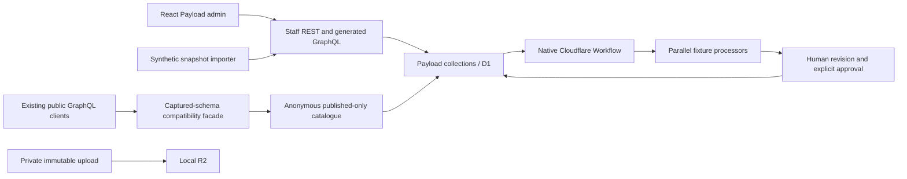

# Payload catalogue / Cloudflare Worker Preview

**Decision: continue the isolated catalogue experiment; do not replace the public gateway yet.** Payload editing, D1, R2 and the generated GraphQL API work in local workerd. The public compatibility facade preserves the captured gateway schema, but external domain resolvers are incomplete. Academy OIDC is now implemented for preview/Payload sessions; successful live sign-in remains unverified. The official MCP plugin failed its Workers initialization gate and is excluded by default. Media orchestration is real local Cloudflare Workflows; media processing uses explicitly labelled fixtures.

This is the first Academy checkout integration of the Payload catalogue experiment and video-review foundation. It is deliberately additive: the existing public gateway and domain services remain authoritative while this project is evaluated. No production route, DNS change, production mutation, real email, private media import or copied production credential is part of this change. A named Cloudflare Worker Preview has been smoke-tested from the PR deployment path with isolated preview D1/R2 resources. All fixture records are synthetic; only public schema/source reads informed the model. `.dev.vars`, `.runtime`, `.wrangler`, build products and dependencies are local ignored state.

## Run locally

The experiment was originally verified with Node 26.10.0, Payload 3.90.2, Next 16.3.8, OpenNext Cloudflare 1.20.1, Wrangler 4.116.0, GraphQL 16.14.2 and React 19.3.0. The project now pins Wrangler 4.147.0 because Cloudflare Worker Previews require Wrangler 4.135.0 or later. Exact workspace dependencies are locked in the repository `bun.lock`.

From the repository root:

```sh
bun install --frozen-lockfile
cd projects/rawkode.academy/payload
bun run setup
bun run migrate
bun run build:worker
bun run preview
```

The default preview uses Academy OIDC and disables password login, reset and bootstrap. Open [the account page](http://127.0.0.1:3100/account). See [OIDC setup and evidence](evidence/oidc-integration.md) for the exact client registration, staff allowlist and tests. Live end-user sign-in and production admin routing remain unverified.

For the original synthetic editorial tests only, stop preview and explicitly opt into local staff fallback:

```sh
bun run preview -- --var POC_DEV_LOCAL_AUTH:true
```

Keep that explicitly flagged preview running. In another terminal:

```sh
bun run bootstrap
bun run import -- --dry-run
bun run import
bun run check:schema
bun test
bun run test:worker
bun run test:pipeline
bun run test:admin
```

`setup` creates fresh local secrets and `.runtime/admin.json` with generated staff credentials. `bootstrap` requires the explicit development flag, registers the initial local staff account and verifies login without printing its password. Read that local file to log into [the admin](http://127.0.0.1:3100/admin). Never include it in an archive. The browser test uses macOS Google Chrome by default; set `CHROME_PATH` to another installed Chromium executable where necessary.

`bun run dev` uses Next's Node development server and is only a convenience. **It is not Workers evidence.** Use the OpenNext build and `wrangler dev --local` above for acceptance. Run migrations with the preview stopped to avoid local D1 lock contention. Build uses a separate ephemeral binding proxy to prevent concurrent Next build workers from sharing the persistent SQLite file. A Workflows-binding warning during the build proxy does not represent the actual preview: `preview` binds `MediaWorkflow` through the custom Worker entry point.

The checked-in config keeps local bindings at the top level and defines an explicit `previews` block. Worker Previews use separate preview-safe D1/R2 resources, which are declared in `wrangler.jsonc`; provision equivalent resources before deploying from another account. The preview task is invoked by the cuenv pull-request pipeline and uses `wrangler preview`, not the older `versions upload` flow. Removing `.wrangler/state` discards this experiment's local database, media and workflow state; archive it first if you want the generated test data. Regenerate local state through migrations/bootstrap/import instead of copying anyone else's credentials.

Cloudflare's [Worker Previews](https://developers.cloudflare.com/workers/previews/) provide the PR environment. The [configuration model](https://developers.cloudflare.com/workers/previews/configuration/) does not inherit production variables or storage bindings, so this project keeps preview resources explicit. The existing Workflow is referenced from the preview binding; Cloudflare does not create a new Workflow per branch.

## Boundaries and API routes



| Route | Contract |
| --- | --- |
| `POST /`, `GET /?query=...`, `/graphql` | Academy-compatible, query-only GraphQL. Root routing preserves the existing gateway URL shape. Plain `GET /` shows the experiment page. |
| `/api/graphql` | Payload-generated schema and authenticated catalogue mutations. Deliberately separate from the public contract. |
| `/api/{collection}` | Payload REST. Staff CRUD; public catalogue reads filter drafts/tombstones. |
| `/admin` | Stock React/Next Payload admin with Academy OIDC staff authorization. |
| `/api/poc/import` | Staff-only snapshot import. No remote source fetching; dry-run supported. |
| `/api/poc/pipeline` | Staff registration, resume, review edit and approval commands. |
| `/api/poc/pipeline/callback` | Separate local machine secret for Workflow results. |
| `/api/poc/runtime` | Local runtime/binding probe. |
| `/api/mcp` | Absent by default following failed Workers evaluation. |

OIDC users default to customers. Only subjects explicitly listed in `OIDC_STAFF_SUBJECTS` receive staff access. Identity mapping uses issuer and subject, never email. Local password accounts are available only with the explicit development flag and loopback callback configuration. Source media is private and immutable through the API after upload. Public catalogue metadata does not grant access to private R2 objects. There is no playable private-media delivery implementation here.

## Model and import rules

| Collection | Mapping and relationship strategy |
| --- | --- |
| `videos` | Existing IDs, slugs, dates, categories/types, text/terms, URLs; ordered guests, technologies and chapters; explicit episode. |
| `people` | Names, biography, links, source GitHub/avatar metadata; reverse appearances/hosted shows resolve publicly. |
| `technologies` | Taxonomy, aliases, links, feature/use-case lists and learning resources. |
| `shows`, `episodes` | Stable IDs, show hosts, source episode code and video relationship. `Episode.show` is authoritative for public show episodes; imported `Show.episodes` is read-only in admin. |
| `chapters`, `learning-resources` | Chapter time/title; official/community/tutorial URL lists. |
| `articles` | Text/source body, publication date, authors, technologies and resources. |
| `courses`, `course-modules` | Ordered module relationships, course/video/resources, section/order and source body. |
| `learning-paths` | Ordered courses/videos, technologies, prerequisites, difficulty and duration. |
| `series`, `adrs`, `testimonials`, `news`, `changelog` | Static editorial records with source frontmatter/body retained for editing and reconciliation. |
| `static-assets` | Local Astro assets uploaded to checksum-addressed R2 keys with source paths and checksums. |
| `seasons`, `competitors`, `brackets`, `bracket-applications`, `teams`, `team-members`, `bracket-breaks`, `bracket-entries`, `matches`, `match-results` | Pre-launch Klustered competition data imported by stable source IDs and linked relationships. |
| `team-invites`, `registrations` | Sensitive Klustered records; excluded by default and imported only with an explicit `--include-sensitive` gate. |

All catalogue and Klustered collections support Payload versions/drafts where editorial review is useful. REST and generated GraphQL expose real editing and mutations. `sourceBody` preserves source Markdown/MDX verbatim, while `sourceData` preserves the original frontmatter/YAML object. The static importer walks the repository content tree, derives chapters and learning resources, records local assets, and can upload them to R2. The Klustered exporter reads the existing `platform-brackets` D1 database into a stable JSON snapshot. Existing stream/thumbnail URLs are retained as data; media is not fetched automatically as part of this migration.

The complete migration procedure, sensitive-data gate, reconciliation requirements and rollback are documented in [content migration evidence](evidence/content-migration.md).

`legacyId` is a unique string within its collection and is returned by the compatibility layer. Numeric Payload database IDs stay internal. New editorial records need a deliberate legacy ID, legacy type and slug. Publication does not mint replacement public IDs. URL redirect/slug-change policy still needs production decisions.

Importer input is `{sourceSystem,mappingVersion,sequence,records}`; each record carries `collection,legacyId,legacyType,slug,sourceRevision,status,data,relationships`. References use `{collection,legacyId}`. See `fixtures/catalogue.json` for the exact format. The CLI only permits loopback targets; `--file=/absolute/snapshot.json` selects an explicit local snapshot.

- Validate identifiers, reserved fields and relationship shapes before writes. Hash canonical mapped source content, including source order and mapping version.
- Create/stage nodes first, then resolve relationships and publish complete records. Valid cycles and array order survive. Missing or tombstoned dependencies propagate to dependent pending records; replay resolves them when the missing source arrives.
- An unchanged completed snapshot is a no-op. Changed content needs a higher source sequence; stale/inconsistent sequences conflict. Prior source fields cannot disappear silently: clear them explicitly with `null` or `[]`.
- Editorial changes mark `locallyEdited`; subsequent imports report conflicts without overwriting them. Import provenance cannot be rewritten through normal editing. No automatic conflict merge is provided.
- Deletion creates a durable marker. Reimport cannot resurrect that ID. Reconciliation is deliberately manual. Source deletions require explicit tombstone records; omission from a snapshot never deletes content.
- Imports are **serialized, per-record and non-atomic**. Use an exclusive import window with no simultaneous editorial/import writes. A failed run leaves resumable pending drafts; a previously published version can remain visible until a replacement is completed. There is no transaction spanning the whole graph and no D1 compare-and-swap guarantee against concurrent editors.

## GraphQL compatibility

The public gateway at `https://api.rawkode.academy/`, deployed website subgraph and pinned repository schema were independently captured on 2026-10-04. Public source revision: `31edd9fd9d86c21a7e9a3a34cfe1933b44e99598`. Evidence includes raw introspection, SDL, checksums and representative operations. `capture:schema` deliberately refreshes these public baselines; ordinary checks do not update them.

`src/compat.ts` builds the facade from captured gateway introspection. This preserves String versus ID distinctions, nullable roots, bare-list responses, arguments/defaults, enums, Date/DateTime and directive definitions. GraphQL 16.14.2 is necessary to retain the captured directive locations. The current gateway has no Mutation root; staff mutation support is exclusively in the generated Payload API.

| Surface | Result / limit |
| --- | --- |
| Gateway schema | Exact SDL/directive comparison and zero breaking/dangerous changes against the dated capture. Schema equality alone is not behavioral parity. |
| Catalogue roots and traversal | Existing IDs, source ordering, relationship order, null/missing behavior and date conversion exercised. Latest/search/random exclude future dates; all-videos preserves source behavior. |
| Pagination/search | Source `Array.slice` offset/limit semantics retained, including zero/negative/null cases. Case-insensitive substring search uses title/subtitle/description. |
| Random | Membership/count preserved; Fisher-Yates replaces the source random comparator. Exact selection order is unspecified. |
| Drafts and relationships | Anonymous, published-only, non-tombstoned reads; targets are re-read through access checks. No staff request/session flows into this facade. |
| Articles/courses/paths | Editable in Payload; absent from the existing gateway schema and therefore not added implicitly. |
| `me` | Always `null`. Identity headers do not impersonate a customer. **Blocks authenticated-client replacement.** |
| Reactions, watch history, preferences, brackets/seasons | Schema retained; explicit `DOMAIN_NOT_IMPLEMENTED` errors. **Blocks full gateway replacement.** |
| Subgraph drift | `getUpcomingVideos`, `personByGithub`, Person GitHub/avatar fields and federation internals are not in the captured gateway facade. This is not a drop-in federation-subgraph implementation. |

The adapter currently reads required collections in batches of 100 and caches only within a request. Full catalogue performance, query cost controls, caching/invalidation and published endpoint behavior are unmeasured. Episode IDs/codes are imported explicitly; future editorial episode lifecycle invariants need domain commands. Details: `evidence/schema-semantics.json`, `evidence/schema-compatibility.json` and `fixtures/schema-operations.graphql`.

## Media orchestration and MCP result

The native Workflow verifies source bytes, forks deterministic transcription and encoding fixture steps, joins a fixture summary/chapter result, and delivers a separately authenticated callback. A per-run persisted execution counter proves fail-once retry behavior. Outputs explicitly report `encoded:false`, `playable:false`. The one-second synthetic MP4 is not customer media. Fixture processing is limited to 2 MiB.

A run is keyed by video/version/checksum; a new cut requires a new private video record in this POC. Completed machine callbacks cannot overwrite reviewed state. Human summary edits change the approval revision. Approval rechecks source bytes and the review revision, creates chapters and publishes metadata; stale approval and generic publication of linked pipeline videos are rejected. Approval/edit/registration still require serialized operation: read-then-write checks are not an atomic concurrency protocol. There is no complete immutable `video_versions` product model yet.

[Target media provider plan](evidence/media-providers.md) covers Workers AI Whisper, Workers AI Llama, Container/Sandbox ffmpeg, chunking, provenance, retries and cloud acceptance gates. These live adapters are **not implemented or verified**. Publishing fixture metadata does not establish working video playback or a production publishable media manifest.

The official `@payloadcms/plugin-mcp` configuration was built and exercised in workerd. Staff authentication/key creation and anonymous denial passed, but authorized `initialize` failed with HTTP 500 (an earlier run ended 503); workerd reported a hung request. Discovery and read/write tools were never reached. No MCP replacement is justified. Disposable test keys were removed. See [MCP findings](evidence/mcp-notes.md) and `evidence/mcp-runtime.json`.

The installed package remains pinned for reproduction, but `src/optional-mcp.ts` has no runtime import of it. To reproduce only in this disposable local environment, stop preview, run `node scripts/enable-mcp.mjs --enable`, build/preview, then `npm run test:mcp`. Disable again with `node scripts/enable-mcp.mjs` and rebuild. The schema includes unused MCP evaluation tables. Never infer MCP support from installation or a successful build.

## Verification and migration gates

`evidence/verification.json` records the original catalogue run; [OIDC verification](evidence/oidc-verification.json) records the current auth changes and fresh regression results. `npm test` covers semantic GraphQL and OIDC protocol tests. `npm run test:worker` covers actual Worker/D1/R2 catalogue integration and requires the explicit local staff fallback. `test:oidc:worker` exercises the OIDC-only default with locally seeded sessions. `test:worker` is the integration-only subset; `demo:mutations` is its alias and creates disposable synthetic data. `test:pipeline` covers native Workflow retry, review and approval. `test:admin` logs in, creates/edits a draft and confirms reload persistence in Chrome; its screenshot is `evidence/admin-edit-view.png`. Repeated tests add uniquely named fixture records to local state.

The official [Cloudflare D1 template](https://github.com/payloadcms/payload/tree/v3.90.2/templates/with-cloudflare-d1) informed the runtime setup. It calls for a paid Workers plan and warns that GraphQL support on Workers is not guaranteed. Our generated GraphQL query/mutation evidence applies to these pinned versions in local workerd only. [D1 read replicas](https://payloadcms.com/docs/database/sqlite) remain experimental and disabled. The pinned D1 adapter required an explicit [insert-on-miss workaround](evidence/d1-upsert.md) after the preference regression test reproduced HTTP success without persistence; the final build uses `src/d1-adapter.ts`. This is additional maintenance burden, not an unmodified upstream success. Known reports about [blank edit views](https://github.com/payloadcms/payload/issues/15712) and [D1 upsert persistence](https://github.com/payloadcms/payload/issues/17202) motivated targeted checks; passing local tests does not close those upstream issues or establish cloud deployment compatibility.

Recommended coexistence: keep the existing gateway and interaction/preference/competition services authoritative while evaluating a Payload-backed catalogue boundary. Do not dual-write the catalogue. Before any cutover:

1. Complete an actual public-source exporter, reconcile every ID/slug/relation/body and count at a source watermark, and resolve conflicts explicitly. Measure representative catalogue queries at full volume.
2. Either preserve federation by implementing/verifying a catalogue subgraph or route every external domain through verified existing services. Integrate Academy identity and cross-domain authorization. Exact public SDL is necessary but insufficient.
3. Create an explicitly isolated paid cloud environment and verify migrations, D1 persistence, R2 access, admin, generated GraphQL, Workflow recovery and routing there. Add atomic domain concurrency controls and an audit trail before multiple writers.
4. Run real consumer operations against both old and candidate endpoints, compare data/errors/URLs, and rehearse a bounded switch with a write freeze and source watermark. Keep the old authority available for rollback.
5. Roll back by stopping candidate writes, exporting/reconciling every accepted post-watermark edit, then restoring routing to the previous authority. Restoring an old database alone loses edits; dual writes are not a rollback strategy.

The local POC is a **go for further catalogue work**, a **no-go for public gateway cutover**, a **no-go for official MCP replacement on Workers**, and a **no-go for real media processing** until the documented gates pass.

[Frontend design note](evidence/frontend-architecture.md): supported React/Next Payload admin; proposed Vue/Nuxt customer preview; `live-preview-vue`; shared Panda CSS v2 tokens/recipes/CSS and framework-specific Ark UI components. The stock admin and a minimal account/sign-in page exist here.

[Optional stretch inventory](evidence/stretch-inventory.md): source-backed marketing/customer preferences, provider-abstracted Workers email and seasons/brackets planning, with identity/consent/command dependencies, acceptance and rollback. Nothing was migrated or sent. “Custard” remains ambiguous; the note identifies the evidenced Klustered domain without assuming equivalence. Stretch work is not a prerequisite for this catalogue experiment.

Deployment coordination: see [admin hostname prerequisites](evidence/deployment-prerequisites.md). The PR path now deploys a named Cloudflare Worker Preview with isolated preview D1/R2 resources. The production `admin.rawkode.academy` route, staff allowlist and customer data remain intentionally unconfigured; complete those gates before treating the admin as live.
