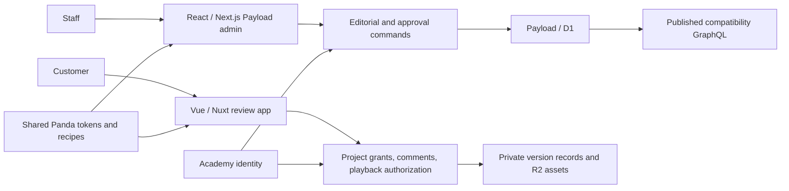

# Proposed frontend architecture — experimental design note

Status: design only, checked against official documentation on 2026-10-04. This POC implements the Payload service and its existing React admin. It does not implement a Vue/Nuxt customer app, Panda CSS integration, Ark UI components, or authenticated Vue live preview.

## Keep two application boundaries

Payload's admin is built with React and the Next.js App Router. Keep that supported stack for staff catalogue editing, metadata review, relationships and explicit publishing commands. Custom admin views remain React components. [Payload admin documentation](https://payloadcms.com/docs/admin/overview).

Build the customer review application in Vue/Nuxt at `preview.rawkode.academy`. It should consume purpose-built review endpoints for project membership, shared video versions, timestamped comments, review status and private playback authorization. Do not give customer browsers a staff Payload session. Existing Academy identity remains authoritative; a validated identity subject maps to customer/project grants independently of editorial Person records. The compatibility GraphQL endpoint continues to serve published public catalogue data.

## Vue live preview is an editor feature

Payload provides `@payloadcms/live-preview-vue` and a `useLivePreview` composable for Vue 3/Nuxt 3. The admin preview communicates with the embedded frontend through `postMessage`; the composable updates initially fetched document data. This supplies rendering integration, not an authorization policy. [Payload client-side live preview](https://payloadcms.com/docs/live-preview/client).

For a future implementation, use a dedicated authenticated draft-preview route. Fetch initial drafts through the staff identity boundary with access checks enabled; authorize every relationship fetch as well. Restrict frame ancestors and accepted message origins to the configured admin/preview origins. Never place reusable staff credentials in preview URLs or public HTML. Return private, non-cacheable responses. A customer review link should identify an explicitly shared immutable video version, not the editor's changing draft or unsaved preview state.

The documented Vue/Nuxt versions establish an available integration path; compatibility with the eventual chosen Nuxt version, cross-origin cookies and deployment setup remains an implementation gate.

## Share styling contracts, keep framework components separate

Panda CSS v2 is the intended styling tool. Its official release notes describe direct `.vue` extraction and a common styling API based on tokens, recipes and patterns; the separate Vue extraction plugin is no longer required. Pin all Panda packages to one tested v2 patch version rather than mixing major versions. No Panda version has been installed or validated by this POC. [Panda v2 release notes](https://panda-css.com/blog/panda-css-v2).

Create one shared design package containing semantic colour, spacing, typography, focus and motion tokens, plus recipes for common visual states. Export a versioned preset and generated CSS/class-name contracts that both application builds can consume. Ensure recipe variants are statically discoverable in both build pipelines; test CSS ordering and prevent a global reset from breaking Payload admin styles. Custom React admin extensions and Vue customer components can share appearance without sharing a component runtime. [Panda design and build model](https://panda-css.com/docs).

Ark UI provides headless components with React and Vue adapters. Use `@ark-ui/react` for custom React surfaces and `@ark-ui/vue` for customer components, applying the shared Panda recipes to each. Share component specifications and accessibility expectations; retain framework-specific state, events and composition. [Ark UI architecture and supported frameworks](https://ark-ui.com/docs/overview/about).

## Acceptance before implementation sign-off

- Academy identity works in both applications; denied users cannot fetch draft records, populated relationships, playback assets or comment data.
- One Vue draft preview updates only within an authorized staff preview session. Invalid origins and expired sessions fail closed.
- A customer sees only explicitly shared versions; publishing a new draft does not expand a grant.
- Shared tokens render consistently across one React custom admin view and one Vue review screen without affecting the stock admin unexpectedly.
- Keyboard navigation, focus restoration, dialogs, contrast and reduced motion pass browser checks in both frameworks.
- Public GraphQL schema and URL checks remain unchanged. Vue/Nuxt delivery does not require replacing the React Payload admin.
