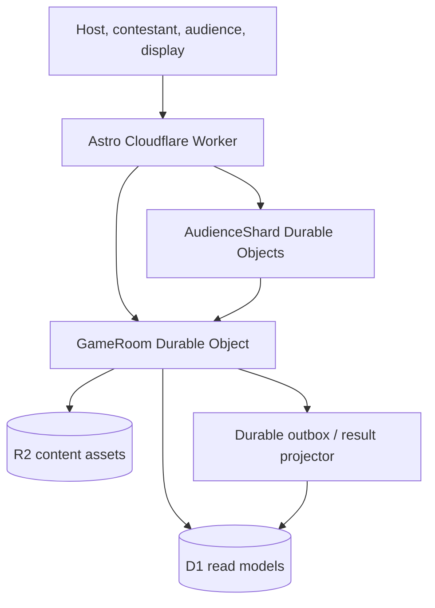

# Rawkode Arcade

Rawkode Arcade is a live, developer-themed game-show platform for
`play.rawkode.academy`. A host runs a room, contestants play from their own
devices, an audience participates at livestream scale, and a display-safe view
can be placed directly into a broadcast scene.

The six launch games are original implementations inspired by familiar game
mechanics:

| Game ID | Public name | Core mechanic |
| --- | --- | --- |
| `merge-conflict` | Merge Conflict | Teams predict the most popular developer-survey answers. |
| `spinlock` | Spinlock | Contestants solve technical phrases from a progressively revealed board. |
| `principal-engineer` | Who Wants to Be a Principal Engineer? | An escalating multiple-choice ladder with developer-themed assists. |
| `race-condition` | Race Condition | Contestants race a resident expert through timed questions. |
| `ten-nines` | Ten Nines | A team attempts to name ten entries from a bounded technical list. |
| `null-pointer` | Null Pointer | Correct but uncommon audience answers score best against a frozen distribution. |

## Architecture

Astro supplies the web shell and server routes. Ark UI provides accessible
interaction primitives and Panda CSS v2 owns styling. The application is built
and tested with Bun, then deployed as a Cloudflare Worker. No Node.js process is
required in production.



`GameRoom` is the single writer and authoritative clock for one room. Its SQLite
storage contains command idempotency keys, a monotonically increasing event
sequence, replay data, and authoritative room state. Audience
connections are spread across 32 `AudienceShard` instances; shards aggregate
participation and forward bounded batches to the room. D1 contains queryable,
eventually consistent leaderboards and other read models. Terminal results must
reach D1 through the durable outbox and an idempotent projector; the release
suite treats that end-to-end path as a required invariant. R2 stores content
imports and media, not secret answers in flight.

The realtime protocol is versioned and shared by every game. Commands are
validated before authorization, accepted at most once by command ID, reduced to
events, committed, and only then projected to role-specific views. The room
offers a role-redacted replay suffix or snapshot fallback. Browser reconnect is
not considered production-ready until the end-to-end suite proves ticket
renewal, sequence resume, and duplicate-free recovery.

The public server contract is intentionally small:

| Method and route | Purpose |
| --- | --- |
| `POST /api/rooms` | Create a room for an authenticated host. |
| `GET /api/rooms/[roomId]` | Read host-safe room metadata. |
| `POST /api/rooms/[roomId]/start` | Start an admitted room idempotently. |
| `POST /api/rooms/[roomId]/invite` | Mint a scoped contestant, audience, or display invitation. |
| `POST /api/rooms/[roomId]/ws-ticket` | Exchange an established session for a single-use socket ticket. |
| `POST /api/join/[code]` | Join a room using its public code. |
| `GET /api/leaderboards` | Read the durable leaderboard projection. |

State-changing routes require an idempotency key. Clients receive the live state
over a ticketed WebSocket, not by polling secret-bearing room storage.

## Repository map

| Path | Responsibility |
| --- | --- |
| `src/protocol/` | Versioned envelopes, commands, events, and runtime validation. |
| `src/domain/` | Deterministic engine, room state, roles, redaction, clock, and registry. |
| `src/games/` | Six game plugins implementing the shared contract. |
| `src/durable-objects/` | Authoritative room and sharded audience coordination. |
| `src/server/` | Ticket issuance, result projection, and server-only helpers. |
| `src/pages/` | Astro HTTP and role-specific UI routes. |
| `tests/` | Bun contract and integration acceptance tests. |
| `e2e/` | Playwright multi-role and accessibility journeys. |
| `scripts/load-rehearsal.ts` | Configurable WebSocket fan-out and latency gate. |

## Local setup

Requirements are Bun, `cuenv`, and a Cloudflare account for remote resources.
From the monorepo root:

```bash
cuenv sync -A
bun install
cd projects/rawkode.arcade
bunx wrangler@4.96.0 d1 migrations apply DB --local
bun run dev
```

Use the generated local URLs rather than calling a Durable Object directly.
Wrangler/Miniflare provides local D1, R2, and Durable Object bindings.
Seeded rooms and content must use a fixed clock and deterministic random seed so
the same fixture can drive domain, integration, and browser tests.

Run the fast suites with:

```bash
bun run test
bun run check
bun run build
```

Run browser acceptance against a dedicated local test Worker. The Worker and
Playwright process must receive the same seed secret; setting it only on the test
client leaves the seed route disabled:

```bash
bunx playwright install chromium
ENVIRONMENT=test E2E_SEED_SECRET=local-e2e-secret \
  bunx wrangler@4.96.0 d1 migrations apply DB --local
ENVIRONMENT=test bunx wrangler@4.96.0 dev \
  --var ENVIRONMENT:test \
  --var ADMISSION_ENABLED:true \
  --var E2E_SEED_SECRET:local-e2e-secret \
  --var SESSION_SECRET:local-session-secret \
  --var TICKET_SECRET:local-ticket-secret
# In a second shell:
E2E_SEED_SECRET=local-e2e-secret \
  ARCADE_E2E_BASE_URL=http://127.0.0.1:8787 \
  bunx playwright test --config e2e/playwright.config.ts
```

The browser suite expects the stable selectors documented in
[`e2e/SELECTORS.md`](e2e/SELECTORS.md). Selectors are a test contract, not a CSS
hook.

E2E rooms are created only through `POST /api/testing/seed` with
`x-arcade-test-secret`. The endpoint must return 404 unless the deployment is the
isolated test environment and the secret matches. It returns short-lived role
invite codes, never a ticket, cookie, or private marker. Each isolated browser
then uses the normal join API and production WebSocket transport. Never configure
this endpoint or `E2E_SEED_SECRET` in preview or production.

Test dependencies are `@playwright/test`, `@axe-core/playwright`, Vitest, and the
Cloudflare Workers pool. Bun covers pure game/content tests; the Workers pool
executes storage and realtime acceptance against production modules and bindings.
Contract adapters and skipped acceptance cases fail the release gate.

## Data and deployment

Create separate D1, R2, and Durable Object resources for preview and production.
This release uses the room's durable SQLite outbox rather than a Cloudflare
Queue. Never point a preview Worker at a production Durable Object
namespace. Build and generate the environment-specific Wrangler file before
every remote operation. That file carries the real D1/R2 bindings and Access
configuration; the placeholder development config is not a production target.

```bash
cuenv sync -A
cd projects/rawkode.arcade
bun run build
bun run scripts/cloudflare-config.ts preview --provision
bunx wrangler@4.96.0 d1 migrations apply DB --remote --config .wrangler/deploy-preview.json
bun run scripts/cloudflare-config.ts production --provision
bunx wrangler@4.96.0 d1 migrations apply DB --remote --config .wrangler/deploy-production.json
```

Migrations must be forward-compatible with the previously deployed Worker.
Deploy in this order:

1. Create or verify Cloudflare resources, bindings, secrets, and routes.
2. Verify additive D1 migrations against a restored production backup and verify
   the Worker-bundled outbox projector with its idempotent retries.
3. Run `bun run build && bun run scripts/deploy-cloudflare.ts preview`; the
   deployment helper closes admission, applies migrations with the generated
   preview config, installs secrets, deploys, and only then reopens admission. A
   failure leaves admission closed.
4. Execute contract, browser, reconnect, and load smoke tests.
5. With no active broadcast rooms, run `bun run deploy`; it uses the same serial
   close → migrate → secret → deploy → reopen sequence with the generated
   production config. Then run a two-client canary room.
6. Enable traffic gradually, watching latency, close codes, command rejects,
   projector lag, and error rate.
7. Remove old columns or compatibility code only in a later release.

Durable Object class renames and storage migrations require an explicit
Cloudflare migration stanza. They must never be inferred from a source rename.
Rollback the Worker before rolling back data; additive schema changes remain
compatible with the preceding release.

## Operating a game

### Host

The host view is `/host/[roomId]`. Room creation and invitation routes require a
server-provisioned host or producer identity; an anonymous session is not host
authentication. Do not expose host invite codes on stream. Host recovery is a
launch blocker until a dedicated, revocable recovery credential flow is
implemented and exercised; the current room code is not a recovery credential.

### Contestant

Open `/join`, enter the short code, and continue to `/play/[code]`. The join API
at `/api/join/[code]` returns only the identity and role needed by that browser.
The join request carries a display name and an allowed team identifier, and the
server binds those fields to the room-scoped identity rather than trusting later
command payloads. Submitted commands remain pending until acknowledged; a retry
reuses the same command ID and must not score twice. Reconnect claims remain
disabled until the browser recovery acceptance test passes.

### Audience

Open `/audience/[code]`. Audience clients are assigned to one of 32 shards and
receive a single-use, short-lived WebSocket ticket from the server. Reactions,
polls, and answers are aggregated into bounded batches. Null Pointer accepts one
answer per audience identity until the host closes the round. Closing atomically
freezes the distribution; later answers and retries cannot change rarity or
score.

### Display

Use `/display/[code]` in OBS or the venue browser source. The display has no
control privileges and never receives unrevealed answers, host notes, recovery
credentials, or contestant secrets. Prefer a 1920×1080 browser source with
hardware acceleration. Test reduced-motion and safe-area behavior before going
live.

Leaderboards are available at `/leaderboards`. `/admin/content` is only an
operator surface when its reads and writes are backed by authenticated
host/producer APIs; a static editor or client-only role check is not an
administrative control.

## Recovery

| Incident | Operator action | Expected behavior |
| --- | --- | --- |
| Browser/network interruption | Keep the room open; if automatic recovery fails, rejoin with a fresh scoped invite. | Only a passing reconnect acceptance test permits sequence-resume claims for a release. |
| Host reload/crash | Keep the room actor untouched and use only a provisioned recovery credential. | Do not improvise recovery with a public room or audience code. |
| Projector outage | Restore the outbox projector; do not edit scores in D1. | Re-delivery is safe only when terminal-outbox idempotency coverage passes. |
| Audience shard overload | Disable new admission, preserve existing sockets, and pause audience prompts if shard latency remains above the gate. | The current release batches reactions and votes but does not claim priority shedding. |
| Bad deploy | Stop rollout and restore the preceding Worker version. | Additive schemas and protocol compatibility keep active rooms recoverable. |
| Regional Cloudflare issue | Pause the broadcast or move to the prepared standby segment. | No claim is made for cross-region linearizability of one room. |

Before manual repair, capture the room ID, latest sequence, deployment version,
Durable Object request ID, and relevant trace. Never mutate SQLite or D1 while a
room is live. Prefer replaying an idempotent projection or issuing a documented
host correction command, which leaves an audit event.

The run sheet records the preceding Cloudflare deployment ID and its rollback
command before rollout begins. The admission kill switch is the Worker variable
`ADMISSION_ENABLED`; deploying it as `false` blocks new room, join, and ticket
requests while preserving existing sockets:

```bash
bun run build
bun run scripts/cloudflare-config.ts production --provision
bunx wrangler@4.96.0 deploy --config .wrangler/deploy-production.json --var ADMISSION_ENABLED:false
curl --fail-with-body -X POST https://play.rawkode.academy/api/join/invalid
```

The verification request must return the documented admission-closed response,
not a generic failure. Restore admission only after the incident commander signs
off, using the same generated config and pinned release:

```bash
bunx wrangler@4.96.0 deploy --config .wrangler/deploy-production.json --var ADMISSION_ENABLED:true
```

For ticket or session-secret exposure, first disable admission, then rotate the
affected secret through the generated production config:

```bash
bunx wrangler@4.96.0 secret put TICKET_SECRET --config .wrangler/deploy-production.json
bunx wrangler@4.96.0 secret put SESSION_SECRET --config .wrangler/deploy-production.json
```

This deliberately invalidates outstanding tickets or sessions. Deploy the pinned release, issue new
host recovery credentials, run a canary join, and only then restore admission.
Exercise kill-switch, secret rotation, and deployment rollback in preview before
launch; an undocumented dashboard click is not a production runbook.

## Observability

Production telemetry must attach the identifiers available at each boundary,
including `deployment`, `requestId`, `roomId`, `connectionId`, `role`, `gameId`,
`commandId`, and `eventSeq`. Full structured emission is an observability launch
gate, not a claim made by the current source. Telemetry must not include ticket
values, display names, free-text answers, correct answers before reveal, IP
addresses, or authorization headers.

The following dashboards and alerts are production-readiness requirements, not
features inferred from enabled Cloudflare logs:

- active rooms and connections by role and audience shard;
- connect/upgrade failures and WebSocket close codes;
- command validation, authorization, duplicate, stale, and late rejection rates;
- accepted-command-to-client-event p50, p95, and p99 latency;
- audience batch size, flush age, dropped reactions, and shard imbalance;
- Durable Object CPU, exceptions, storage failures, and alarm drift;
- pending outbox age, projection attempts, retry count, and projection failures;
- room event/snapshot sequence versus D1 projection watermark.

Page the operator for sustained p95 gameplay latency above 250 ms, any role data
leak alert, a growing outbox backlog, a projection watermark that remains
behind for five minutes, or a Durable Object exception rate that threatens an
active broadcast. Logs alone are not an audit trail; authoritative events and
correction commands are.

## Security and privacy

- Validate protocol version, envelope size, command discriminant, payload, and
  string bounds before authorization or storage.
- Bind every connection to a server-issued role and room. Never accept role,
  actor, score, shard, or room authority from a client payload.
- WebSocket tickets are signed, scoped to room/role/participant, short-lived,
  single-use, and recorded against a nonce. A replay is rejected even before
  expiry.
- The application currently enforces bounded protocol messages, per-connection
  frame limits, room-scoped membership, single-use tickets, and idempotent
  commands. Per-IP edge limits, per-room admission caps, heartbeat policy, and
  bounded outbound queues remain deployment gates.
- Redact state on the server for each role. Hiding a DOM element is not access
  control; unrevealed answers must never reach contestant, audience, or display
  payloads.
- Use constant-time signature verification, Cloudflare secrets, and
  secure/HTTP-only cookies where applicable. Strict origin policy, CSP, and
  forced `wss:` are perimeter launch checks and must be verified in preview.
- Vue escapes rendered text, but audience moderation and explicit log-field
  encoding remain launch gates. Do not allow content strings to become HTML,
  CSS, URLs, or log fields without encoding.
- Data retention, deletion tooling, and separation of public leaderboard names
  from authentication identities are policy launch gates; the repository does
  not claim they are already delivered.
- Administrators and host recovery endpoints require stronger authentication
  than a public room code. Rotate recovery credentials after suspected exposure.

Threat modelling explicitly includes answer exfiltration, role escalation,
ticket theft/replay, command duplication, reconnect replay gaps, clock skew,
buzzer races, audience brigading, cross-room access, XSS through content, queue
replay, denial of service, and accidental disclosure in broadcast views.

## Intellectual-property boundary

Rawkode Arcade borrows broad, unprotectable ideas such as quizzes, word puzzles,
ranked survey answers, timed races, list completion, lifelines, and uncommon-answer
scoring. It does **not** copy third-party show names, logos, trade dress, board
layouts, music, catchphrases, character names, typography, audiovisual cues,
question libraries, exact round sequences, or scoring presentations. The names,
visual identity, terminology, prompts, content, transitions, and rules here must
remain independently created and developer-centric.

Do not describe a game publicly as an official adaptation or imply endorsement.
Clear any new name, artwork, audio, or mechanic packaging with counsel before a
commercial launch. The codebase records inspiration only to help reviewers spot
and remove accidental similarity; it is not permission to use third-party IP.

## Production rehearsal gates

No public livestream proceeds until all gates are evidenced against the exact
release candidate:

- all Bun tests, type checking, build, and six seeded Playwright game journeys
  pass in preview;
- automated accessibility checks have no serious or critical findings, with
  keyboard-only host/contestant smoke tests and reduced-motion verification;
- no answer appears in contestant, audience, display, HTML, network payload, log,
  or reconnect snapshot before the reveal event;
- duplicate command, simultaneous buzzer, replay-gap, late-answer, frozen Null
  Pointer distribution, ticket replay, and projector retry tests pass;
- a 30-minute rehearsal sustains 10,000 audience WebSockets across 32 shards,
  with representative votes/answers and p95 accepted-command-to-event latency
  below 250 ms;
- reconnect recovery succeeds during a rolling deploy, and a projector outage
  catches up without duplicate leaderboard effects;
- the operator has tested host recovery, pause, correction, rollback, kill switch,
  and the prerecorded standby scene;
- dashboards, paging routes, run sheet, content moderation, data retention, and
  the named incident commander are ready.

The load command is intentionally explicit and defaults to the production goal:

```bash
ARCADE_LOAD_BASE_URL=https://preview.play.rawkode.academy \
ARCADE_LOAD_ROOM_ID=room_01J00000000000000000000000 \
ARCADE_LOAD_INVITE_CODE=audience_invite_from_host_console \
ARCADE_LOAD_CLIENTS=10000 \
ARCADE_LOAD_SHARDS=32 \
ARCADE_LOAD_DURATION_SECONDS=1800 \
bun run scripts/load-rehearsal.ts
```

Create the audience invite from the production host console immediately before
the rehearsal and keep it valid for the full connection ramp. Every generator
uses that invite to join each anonymous identity through the production
membership path before opening its single-use ticket over the WebSocket
subprotocol.

Run the full goal from load generators with sufficient file descriptors and
network capacity. Every virtual viewer obtains its own signed session and
single-use ticket. The gate rotates idempotent audience reaction windows, counts only correlated
`audience.aggregated` events emitted after the shard flush reaches the
authoritative room, fails on command errors/timeouts or insufficient offered
load, and derives shard counts from server-reported shard IDs.
For distributed generation, set `ARCADE_LOAD_PROCESS_COUNT` and a unique
zero-based `ARCADE_LOAD_PROCESS_INDEX`. All summaries must cover the same
30-minute overlap; merge their `latencyHistogramMs` buckets to calculate the
global p95 and sum server-observed shard connection counts. Per-process
percentiles must never be averaged.
