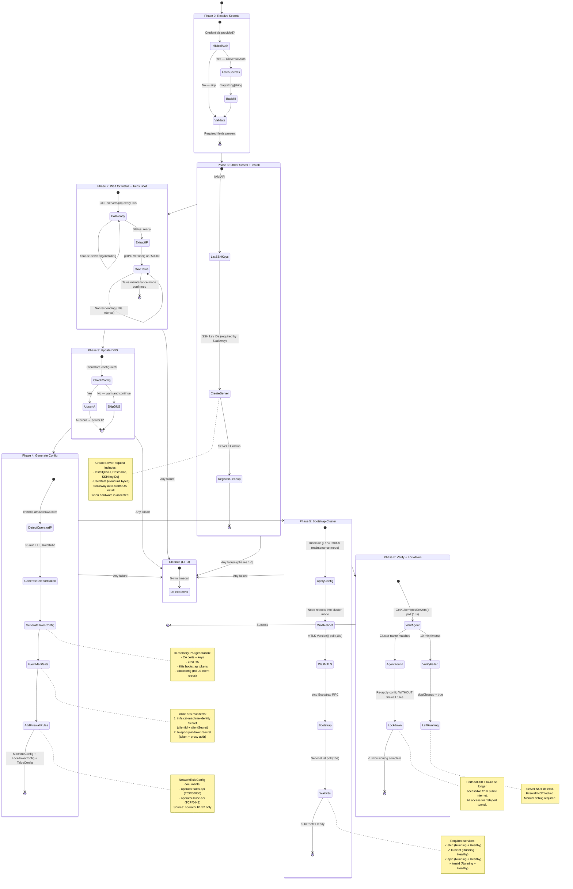
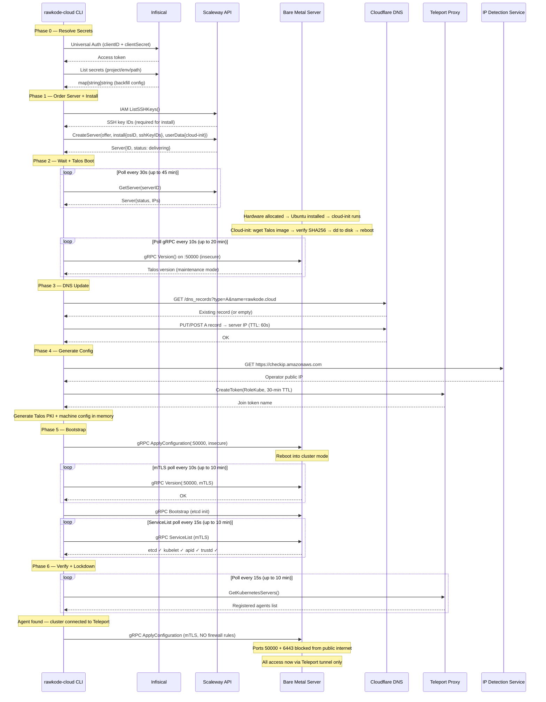
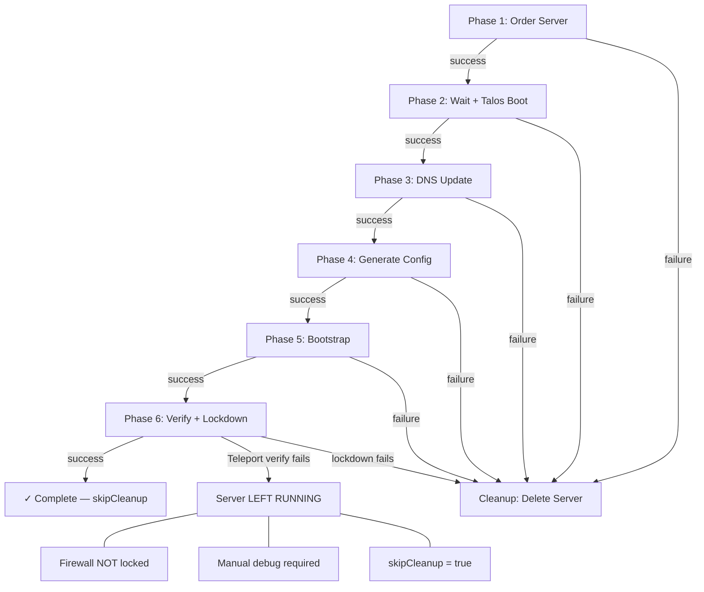

# rawkode-cloud

Bare metal to immutable Kubernetes provisioning CLI.

Provisions physical bare metal servers from Scaleway, pivots them to Talos Linux, bootstraps a Kubernetes cluster, and secures access through Teleport — all with a single command.

No SSH. No local state. Verify-then-lockdown.

## Usage

```bash
# Provision with Infisical resolving all secrets
rawkode-cloud provision \
  --infisical-url https://infisical.example.com \
  --infisical-client-id $CLIENT_ID \
  --infisical-client-secret $CLIENT_SECRET \
  --infisical-project-id $PROJECT_ID

# Provision with explicit flags
rawkode-cloud provision \
  --cluster-name my-cluster \
  --scaleway-offer-id $OFFER_ID \
  --scaleway-os-id $OS_ID \
  --scaleway-access-key $SCW_ACCESS_KEY \
  --scaleway-secret-key $SCW_SECRET_KEY \
  --teleport-proxy teleport.example.com:443 \
  --cloudflare-api-token $CF_API_TOKEN \
  --cloudflare-zone-id $CF_ZONE_ID \
  --cloudflare-dns-name rawkode.cloud

# Destroy a failed provisioning run
rawkode-cloud destroy --server-id $SERVER_ID
```

## Configuration

All settings can come from a config file (`~/.rawkode-cloud.yaml`), environment variables (`RAWKODE_CLOUD_*`), CLI flags, or Infisical secrets. Precedence (lowest to highest):

1. Config file
2. Environment variables
3. CLI flags
4. Infisical (backfills missing values)

## Architecture

### Provisioning Pipeline

7 phases, executed sequentially. Failure at any phase triggers LIFO cleanup (server deletion), except Phase 6 Teleport verification failure which leaves the server running for manual debug.

| Phase | Name | What happens |
|-------|------|-------------|
| 0 | Resolve Secrets | Authenticate with Infisical, fetch and backfill config |
| 1 | Order Server + Install | Single Scaleway API call: create server with OS install + cloud-init |
| 2 | Wait + Talos Boot | Poll Scaleway for ready, then poll Talos gRPC for maintenance mode |
| 3 | Update DNS | Upsert Cloudflare A record pointing at server IP |
| 4 | Generate Config | Detect operator IP, mint Teleport token, generate Talos PKI + manifests |
| 5 | Bootstrap Cluster | Apply config, bootstrap etcd, wait for Kubernetes readiness |
| 6 | Verify + Lockdown | Confirm Teleport agent registered, then remove firewall rules |

### State Machine



### Communication Flow



### Rollback Semantics


