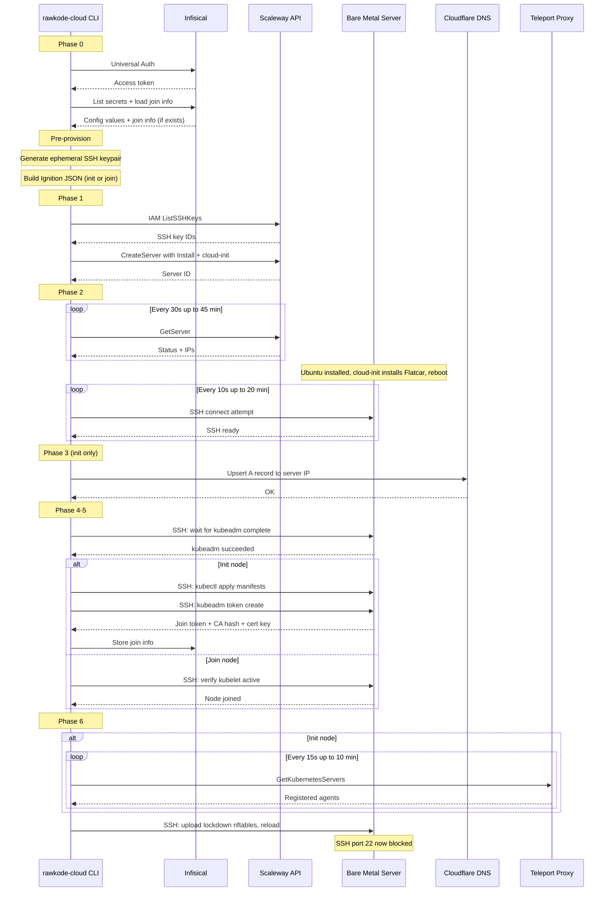
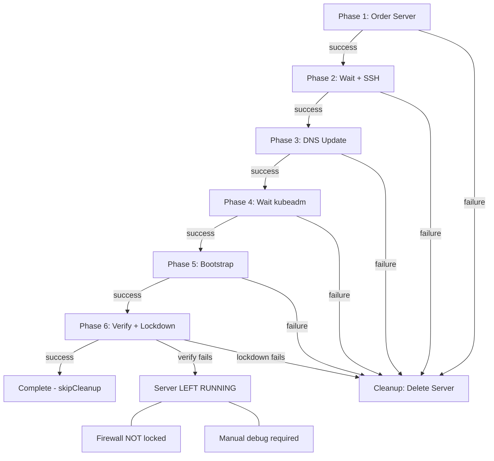

# rawkode-cloud

Bare metal to Kubernetes provisioning CLI.

Provisions physical bare metal servers from Scaleway, installs Flatcar Container Linux, bootstraps a Kubernetes cluster with kubeadm, and secures access through Teleport — all with a single command.

Multi-node: first invocation does `kubeadm init`, subsequent invocations read join info from Infisical and do `kubeadm join`.

## Usage

```bash
# Provision first control-plane node (kubeadm init)
rawkode-cloud provision \
  --role control-plane \
  --kubernetes-version v1.33.2 \
  --cilium-version 1.17.3 \
  --infisical-url https://infisical.example.com \
  --infisical-client-id $CLIENT_ID \
  --infisical-client-secret $CLIENT_SECRET \
  --infisical-project-id $PROJECT_ID

# Join additional control-plane node (kubeadm join --control-plane)
rawkode-cloud provision \
  --role control-plane \
  --kubernetes-version v1.33.2 \
  --cilium-version 1.17.3 \
  --infisical-url https://infisical.example.com \
  --infisical-client-id $CLIENT_ID \
  --infisical-client-secret $CLIENT_SECRET \
  --infisical-project-id $PROJECT_ID

# Join worker node
rawkode-cloud provision \
  --role worker \
  --kubernetes-version v1.33.2 \
  --cilium-version 1.17.3 \
  --infisical-url https://infisical.example.com \
  --infisical-client-id $CLIENT_ID \
  --infisical-client-secret $CLIENT_SECRET \
  --infisical-project-id $PROJECT_ID

# Destroy a failed provisioning run
rawkode-cloud destroy --server-id $SERVER_ID
```

## Configuration

All settings can come from a config file (`~/.rawkode-cloud.yaml`), environment variables (`RAWKODE_CLOUD_*`), CLI flags, or Infisical secrets. Precedence (lowest to highest):

1. Config file
2. Environment variables
3. CLI flags
4. Infisical (backfills missing values)

Cloudflare environment compatibility:
- `CLOUDFLARE_API_TOKEN` (also supports `CF_API_TOKEN`)
- `CLOUDFLARE_ZONE_ID` or `CLOUDFLARE_ACCOUNT_ID` (zone ID is auto-resolved from `CLOUDFLARE_DNS_NAME` when only account ID is provided)
- `CLOUDFLARE_DNS_NAME`

## Architecture

### Stack

- **OS**: Flatcar Container Linux (immutable, auto-updating)
- **K8s bootstrap**: kubeadm
- **K8s binaries**: systemd-sysext from [sysext-bakery](https://extensions.flatcar.org) (kubernetes + cilium)
- **CNI**: Cilium via sysext (kubeProxyReplacement=true)
- **Access**: Teleport zero-trust (optional during first bootstrap; firewall lockdown only runs when Teleport is available)
- **Secrets**: Infisical (join info stored for multi-node)

### Init vs Join

The CLI auto-detects whether to init or join:

1. On Phase 0, it checks Infisical for `K8S_JOIN_TOKEN`
2. If absent → this is the **first node** → `kubeadm init`
3. If present → this is a **joining node** → `kubeadm join`

After init, join info (token, CA cert hash, certificate key, endpoint) is written back to Infisical for subsequent nodes.

### Provisioning Pipeline

| Phase | Name | What happens |
|-------|------|-------------|
| 0 | Resolve Secrets | Authenticate with Infisical, fetch config, load join info |
| Pre | Generate Config | Detect operator IP, generate ephemeral SSH keypair, build Ignition JSON |
| 1 | Order Server + Install | Scaleway API call: create server with cloud-init (installs Flatcar) |
| 2 | Wait + SSH | Poll Scaleway for ready, wait for SSH to become reachable |
| 3 | Update DNS | Upsert Cloudflare A record (init only) |
| 4 | Wait for kubeadm | SSH in, wait for kubeadm init/join to complete |
| 5 | Bootstrap | [init] Apply K8s manifests, extract+store join info / [join] Verify node joined |
| 6 | Verify + Lockdown | If Teleport is configured/reachable: [init] confirm agent, then lockdown firewall (all nodes). Otherwise skip lockdown. |

### State Machine

```mermaid
stateDiagram-v2
    [*] --> Phase0

    state "Phase 0 - Resolve Secrets" as Phase0 {
        [*] --> InfisicalAuth
        InfisicalAuth --> FetchSecrets: Credentials provided
        InfisicalAuth --> Validate: No credentials
        FetchSecrets --> LoadJoinInfo
        LoadJoinInfo --> Backfill
        Backfill --> Validate
        Validate --> [*]
    }

    Phase0 --> PreProvision

    state "Pre-Provision" as PreProvision {
        [*] --> DetectOperatorIP
        DetectOperatorIP --> GenerateSSHKeypair
        GenerateSSHKeypair --> GenerateIgnition
        GenerateIgnition --> [*]
    }

    PreProvision --> Phase1

    state "Phase 1 - Order Server + Install" as Phase1 {
        [*] --> ListSSHKeys
        ListSSHKeys --> CreateServer
        CreateServer --> RegisterCleanup
        RegisterCleanup --> [*]
    }

    Phase1 --> Phase2

    state "Phase 2 - Wait + SSH" as Phase2 {
        [*] --> PollReady
        PollReady --> PollReady: Still delivering
        PollReady --> ExtractIP: Server ready
        ExtractIP --> WaitSSH
        WaitSSH --> WaitSSH: Not responding
        WaitSSH --> ConnectSSH: SSH reachable
        ConnectSSH --> UpdateConfig: Fix kubeadm config with real IP
        UpdateConfig --> [*]
    }

    Phase2 --> Phase3

    state "Phase 3 - Update DNS (init only)" as Phase3 {
        [*] --> CheckDNSConfig
        CheckDNSConfig --> UpsertA: Configured + init
        CheckDNSConfig --> SkipDNS: Not configured or join
        UpsertA --> [*]
        SkipDNS --> [*]
    }

    Phase3 --> Phase4

    state "Phase 4 - Wait for kubeadm" as Phase4 {
        [*] --> PollKubeadm
        PollKubeadm --> PollKubeadm: Still running
        PollKubeadm --> [*]: Completed
    }

    Phase4 --> Phase5

    state "Phase 5 - Bootstrap" as Phase5 {
        [*] --> InitOrJoin
        InitOrJoin --> ApplyManifests: Init node
        InitOrJoin --> VerifyJoin: Join node
        ApplyManifests --> WaitK8sReady
        WaitK8sReady --> ExtractJoinInfo
        ExtractJoinInfo --> StoreInInfisical
        StoreInInfisical --> [*]
        VerifyJoin --> [*]
    }

    Phase5 --> Phase6

    state "Phase 6 - Verify + Lockdown" as Phase6 {
        [*] --> CheckInit
        CheckInit --> WaitTeleport: Init node
        CheckInit --> Lockdown: Join node
        WaitTeleport --> AgentFound: Registered
        WaitTeleport --> VerifyFailed: Timeout
        AgentFound --> Lockdown
        Lockdown --> [*]: Complete
        VerifyFailed --> LeftRunning: Server left for debug
    }

    Phase6 --> [*]: Success

    Phase1 --> Cleanup: Failure
    Phase2 --> Cleanup: Failure
    Phase3 --> Cleanup: Failure
    Phase4 --> Cleanup: Failure
    Phase5 --> Cleanup: Failure

    state "Cleanup - LIFO" as Cleanup {
        [*] --> DeleteServer
    }
```



### Communication Flow



### Rollback Semantics



### Infisical Join Info

After `kubeadm init`, these secrets are stored in Infisical:

| Key | Purpose |
|-----|---------|
| `K8S_JOIN_TOKEN` | kubeadm join token |
| `K8S_CA_CERT_HASH` | CA certificate hash for discovery |
| `K8S_CERTIFICATE_KEY` | Certificate key for control-plane joins |
| `K8S_CONTROL_PLANE_ENDPOINT` | API server address for joining nodes |

### Firewall

During provisioning, SSH (port 22) is restricted to the operator's IP only. After Teleport verification, the firewall is locked down:

- SSH (22): **blocked** (removed from nftables)
- Kubernetes API (6443): allowed (Teleport tunnels through it)
- kubelet (10250): allowed (inter-node)
- etcd (2379-2380): allowed (inter-node)

All cluster access goes through Teleport's encrypted, authenticated tunnel after lockdown.
