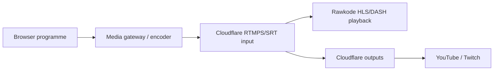
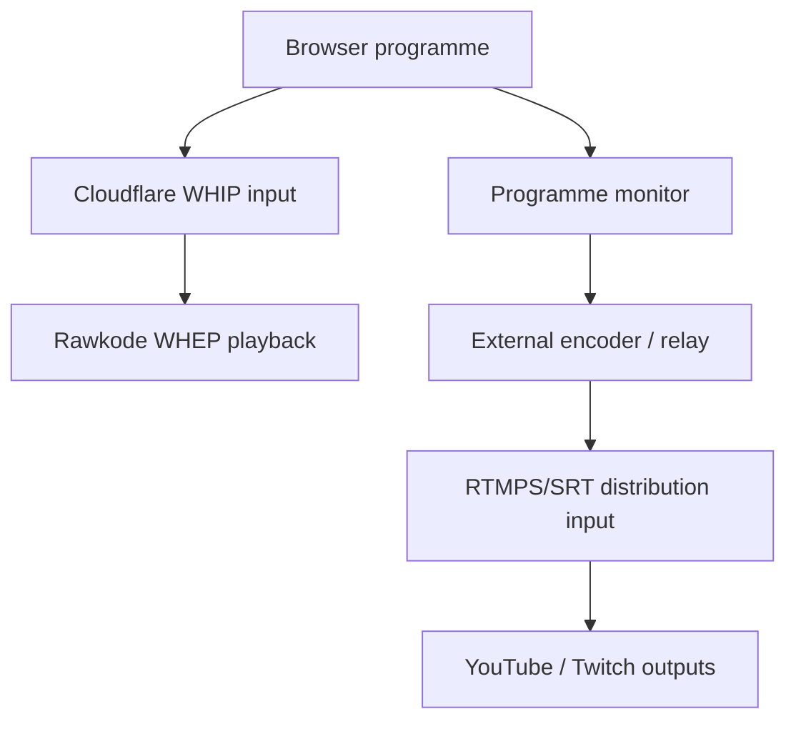

# Rawkode Studio platform capabilities and roadmap

Research date: 2026-09-19

This document benchmarks Rawkode Studio against the feature families exposed by
StreamYard and evmux. It is a planning input, not a product-parity claim. Vendor
pages describe marketed capabilities and plan limits; they do not prove that a
feature works for Rawkode's accounts, browsers, destinations, or event load.
Every provider-dependent release gate below still needs a controlled live test.

## Executive finding

The browser WHIP transport cannot deliver the YouTube behavior described in the
original MVP runbook. Rawkode Studio publishes the Rawkode programme to a
Cloudflare Stream WebRTC input with WHIP. Cloudflare's current documentation says
a WHIP input must use WHEP playback and does not support recording, HLS/DASH
playback, broadcast/player metrics, live viewer counts, or RTMP/SRT simulcasting.

Cloudflare's normal live pipeline is a separate path. It accepts RTMPS or SRT,
can record and serve HLS/DASH, and can forward one live input to as many as 50
concurrent outputs. Outputs can be added, removed, enabled, and disabled through
the API. A browser programme publisher therefore needs either a media gateway
that produces RTMPS/SRT or a separate encoder path before Cloudflare can fan the
programme out to YouTube, Twitch, and similar services.

This checkout now contains the control plane for a separate RTMPS/SRT input and
its outputs. An external encoder must still capture the Programme monitor and
publish media to that input. This remains a release blocker for any event that
requires both Rawkode WHEP playback and YouTube delivery until that complete dual
path passes the live acceptance gates. Attaching an output to the WHIP input does
not fix the incompatibility.

Official evidence:

- [Cloudflare Stream WebRTC overview and limitations](https://developers.cloudflare.com/stream/webrtc-beta/#limitations)
- [Cloudflare Stream RTMPS/SRT live input](https://developers.cloudflare.com/stream/stream-live/start-stream-live/)
- [Cloudflare Stream simulcast outputs](https://developers.cloudflare.com/stream/stream-live/simulcasting/)
- [Cloudflare Stream live-input GET schema](https://developers.cloudflare.com/api/resources/stream/subresources/live_inputs/methods/get/)
- [Cloudflare Stream pricing and WebRTC recording restriction](https://developers.cloudflare.com/stream/pricing/)

## Status vocabulary

| Status | Meaning |
| --- | --- |
| Implemented | An operator-visible path exists in this checkout. Provider-dependent behavior may still need rehearsal. |
| Partial | A useful subset exists, but a material workflow or control is absent. |
| Foundation only | Types, reducers, rendering code, or server primitives exist without a complete operator workflow. |
| Missing | No complete implementation was found in the reviewed Studio code. |
| Invalid assumption | The documented behavior conflicts with the provider's current documented contract. |

The Rawkode assessment is based on the current branch, especially
[`README.md`](../README.md),
[`App.vue`](../src/App.vue),
[`StudioCanvas.vue`](../src/components/StudioCanvas.vue),
[`RealtimeKitRoom.vue`](../src/components/RealtimeKitRoom.vue),
[`StudioWidgets.vue`](../src/components/StudioWidgets.vue),
[`PeopleRail.vue`](../src/components/PeopleRail.vue),
[`seed.ts`](../src/studio/seed.ts), and
[`studioMachine.ts`](../src/studio/studioMachine.ts).

## Capability-family matrix

| Feature family | StreamYard official capability | evmux official capability | Rawkode Studio today | Recommended Rawkode direction |
| --- | --- | --- | --- | --- |
| Browser studio | Studio and guest access run in the browser. | Web-based live editor for setup and live changes. | **Implemented.** Vue programme console plus RealtimeKit room in the browser. | Retain the browser-first workflow and publish a supported-browser matrix. |
| Roles and guest access | Guests join by link without an account; optional Facebook/YouTube authentication; host can remove or ban guests. | Up to 12 on-screen participants, backstage mode, push-to-talk, co-hosts, and collaborator seats. | **Partial.** Host, producer, guest, and program presets; signed guest invites; and producer admit/return-to-backstage controls exist. Explicit departure revokes a durable identity even if it has already reappeared, and an admission change invalidates any older asynchronous canvas commit. Session-manager authorization is deliberately coarser than the role labels. Kick/ban, private talkback, and expiring/revocable invites are absent. | Rehearse admission across browser leave/rejoin and transitions, then add kick/ban, private producer talkback, role-scoped permissions, and expiring/revocable invites. |
| Participant capacity | Six on-screen participants on Free and ten on paid plans. | Up to 12 on-screen participants on the listed plans. | **Unvalidated.** Dynamic grid code handles arbitrary counts, but the end-to-end RealtimeKit, browser, compositor, and audio limit is not stated or load-tested. | Set a supported maximum only after a multi-browser load rehearsal; expose capacity and CPU warnings in the UI. |
| Green room and device setup | Greenroom is offered; guests can check devices before appearing. | Dedicated backstage conversation and one-action move to stage. | **Partial.** RealtimeKit device setup and a producer-controlled backstage/on-stage state exist. New sources fail closed; explicit departure revokes admission; old asynchronous frames are prevented from committing after an admission change. Browser and provider behavior still require a live multi-participant rehearsal. | Validate those invariants live, then add an admit countdown and private return channel. |
| Collaborative production | Business/Teams plans add organizational workflows; guest destinations let guests connect their own channels. | Co-hosts and collaborator seats can host, produce, and moderate; enterprise supports concurrent broadcasts and squads. | **Partial.** Programme state is persisted with revision checks and a second producer can observe it. Stream and recording leases provide takeover safety. There is no operator-presence panel, fine-grained role boundary, or conflict-resolution UI beyond a notice. | Show active operators, control ownership, last edit, and safe handoff. Split producer, moderator, and stream-control permissions. |
| Scene switching | Custom layouts, extra layouts on paid plans, branding assets, and live switching. | Prepared drag-and-drop Pro Scenes, reusable scenes, and live editing. | **Partial.** Five code-defined scenes, separate Preview and Programme monitors, explicit Take, keyboard cues, and scene create/duplicate/rename/reorder/delete controls are operator-visible. Custom scenes persist in programme state. There is no durable template/asset library, version history, rehearsal snapshot, or undo. | Harden Preview/Take under multi-operator conflict, then add templates, version history, rehearsal snapshots, and undo. |
| Freeform composition | Paid StreamYard plans include additional custom layouts. | Full drag-and-drop scene builder is a headline capability. | **Partial.** Layers, bounds, opacity, ordering, locking, HTML, and freeform layout primitives exist; a staged Preview can be interactive while Programme stays non-interactive. This is still a basic scene editor rather than a durable design/asset system. | Complete a safe design mode with undo, validation, and reusable assets while keeping live changes constrained and reversible. |
| Transitions and media lifecycle | Intro/outro clips and studio layouts are available on paid plans. | Prepared scenes support smooth switching; native animated lower thirds are advertised. | **Implemented for the seeded show.** Cut/fade plus slide, flip, typewriter, cube-spin, and other transition primitives; overlay enter/visible/exit lifecycle; Remotion intro/outro. | Add transition preview, duration controls, reduced-motion option, asset readiness checks, and a cut-to-safe-scene control. |
| Branding, assets, and overlays | Logos, colors, banners, tickers, name tags, overlays, backgrounds, clips, and custom fonts depending on plan. | Logos, backgrounds, overlays, lower thirds, banners, tickers, virtual backgrounds, web source/HTML overlays, apps, and widgets depending on plan. | **Partial.** Rawkode-branded Remotion compositions and a lower-third overlay are compiled into seeded scenes. Operator branding controls, banners, tickers, uploaded assets, fonts, browser/web overlays, a durable asset library, and reusable brand kits are not available in the current UI. | Prioritize editable speaker lower thirds, a ticker/banner layer, safe uploaded media, and a sandboxed browser source. Store durable assets with ownership, validation, version, and retention metadata before adding brand kits. |
| Cameras and screen sources | Guest cameras and screen/video sharing; Advanced adds an extra local camera. | Screen sharing; Pro allows as many as three cameras on one device. | **Partial.** Participant cameras and multiple selectable browser screen captures work; per-source programme mute/gain is exposed. Multiple cameras from one participant/device are missing. | Optimize for developer demos: editor/terminal/window presets, crop/zoom, cursor emphasis, source pinning, and rapid screen fallback before adding multi-camera. |
| Slides and prerecorded media | Screen/video sharing and prerecorded streams up to plan limits. | Stored slides and prerecorded streams up to plan limits. | **Missing as an operator workflow.** Video/source types and media-finished actions exist, but no upload/library/slideshow/prerecorded-broadcast UI was found. | Add a preflight media bin with duration/codec validation, then slides and scheduled prerecorded programmes. |
| Audio production | Guest volume/mute controls and local recording tracks. | Per-participant production, push-to-talk, and Pro 320 kbit/s audio. | **Partial and technically strong.** Mixed programme audio, per-person and per-screen-source gain/mute, level meter, and audio source reconciliation exist. Contributors can opt into a browser-local camera/microphone recording. There is no solo/PFL, talkback, noise-processing control, device-health view, or coordinated ISO upload. | Add clipping/absence alarms, PFL/solo, talkback, device change recovery, and an A/V sync test. Document actual codecs/bitrates after capture validation. |
| Multistream distribution | Native integrations plus custom RTMP; Core supports three and Advanced eight destinations; cloud fan-out; simultaneous landscape and portrait via MARS. | Server-side multistream; current plans JSON lists two destinations on Free, four on Basic, and nine on Pro; Basic adds custom RTMP. | **Partial control plane; media path unvalidated.** The browser publisher still sends WHIP to the Rawkode input, which cannot simulcast. A separate Cloudflare RTMPS/SRT input can be provisioned for an external encoder, and outputs can be managed against it. No browser relay exists, so OBS or another encoder must capture Programme and publish it. | Apply migration `0009`, rehearse the external encoder path end to end, and prove independent lifecycle/rollback before promising a destination. |
| Destination operations | Unified destination setup and comments; guest destinations; multiple accounts on the same platform. | Integrated destinations/custom RTMP and server-side fan-out. | **Partial.** A manager-only outputs page and API can provision the separate input and list, create-disabled, enable/disable, and delete Cloudflare outputs. Normal responses project secret-free fields; ingest credentials are returned only by an explicit no-store manager action. An ambiguous provider create becomes `uncertain` and blocks blind retry. Scheduling, destination health, audit events, and live-provider validation remain absent. | Add health and audit state, keep destination keys server-side, minimize ingest-credential exposure, and rehearse the operator kill switch and uncertain-state reconciliation. |
| Landscape and vertical output | MARS produces horizontal and vertical output from one studio session. | No equivalent claim was found on the reviewed official feature pages. | **Missing.** Programme is fixed at 1920×1080/30 in the seed. | Keep 16:9 as the first reliable target. Add a separately composed 9:16 programme only after source framing and dual-encode capacity are measured. |
| Audience chat and comments | Aggregated platform comments, on-screen comment highlighting, chat overlay, giveaways, and webinar chat/reactions. | Integrated chats, comment highlighting, banners, and marketplace widgets. | **Missing.** RealtimeKit may supply contributor-room communication, and `comment` source/lower-third data structures exist, but neither is multichannel audience ingestion. There is no website/social chat normalization, moderation, or live comment workflow. | Build a normalized event model for website and destination chat, then moderation, Q&A queue, on-screen selection, and rate limits. Treat room communication and public audience chat as separate trust domains. |
| Webinars and owned player | Registration, reminder emails, branded/embeddable watch page, chat, registration CSV, and on-demand replay. | Business plans list an embeddable evmux Player with plan viewer limits. | **Partial owned playback only.** Rawkode watch playback/public live state exists by design; registration, reminders, attendee roster, webinar chat, and on-demand event controls are absent. | Keep event identity in Rawkode content. Add scheduled watch state, calendar links, reminders, captions, moderated Q&A, and replay transition incrementally. |
| Programme recording | Paid StreamYard streams are cloud-recorded; local per-participant 1080p tracks are available, Advanced advertises 4K local tracks; live recordings have a ten-hour per-stream limit. | Basic records the composed stream; Pro adds local ISO recordings and 320 kbit/s audio. | **Implemented for mixed programme; partial local ISO.** Browser MediaRecorder captures Programme, stores durable IndexedDB chunks, uploads to R2, hands off to transcode, and exposes recovery. A contributor may separately record their own camera/microphone into IndexedDB and download it. That local artifact is not uploaded, synchronized, or attached to the session recording. | Preserve programme recovery, then add consent-aware ISO upload, timing/alignment metadata, and recording-set reconciliation before promising edit flexibility. |
| Recording resilience | Local tracks continue despite weak participant connections and can resume upload from the participant device. | ISO tracks record on participant devices independent of network quality. | **Strong programme recovery, local-only contributor fallback.** Programme chunks survive browser reload/crash in the original profile, with server lease and retry-safe handoff. Contributor ISO chunks also persist locally and can be downloaded after reload, but have no resumable server upload or producer visibility. | Add participant-local resumable upload and reconciliation while preserving the programme recording as immediate fallback. |
| Recording artifact model | Cloud programme recording and participant-local tracks are exposed as distinct downloadable artifacts. | Composed recording and participant ISO files are distinct artifacts. | **Programme canonical model plus disconnected local files.** The immutable canonical claim models one composed recording per content video. Browser-local contributor files are not represented as a session recording set and have no alignment or reconciliation state. | Introduce a recording set with immutable source artifacts, track identity, timing/alignment metadata, programme renders, edit revisions, and one selected publication. Migrate the canonical-VOD relationship deliberately before ISO upload ships. |
| Post-production and repurposing | In-product trim/split, Shorts/Reels, AI clips, transcript downloads depending on plan. | Basic transcription in English/Spanish is listed; isolated tracks support external editing. | **Missing.** The pipeline transcodes the canonical programme to VOD but exposes no trim, chapter, clip, transcript, caption, or social export workflow. | Generate transcript/captions and event markers first; add non-destructive trim/chapters, then clips and vertical reframing. Keep source and edit provenance. |
| Scheduling and prerecorded broadcasts | Scheduled prerecorded streams and webinars, with plan duration limits. | Scheduled prerecorded streams with plan duration and concurrency limits. | **Partial session scheduling.** Content-backed sessions carry show/start metadata, but destination broadcasts and prerecorded programmes are not scheduled or reconciled. | Create an event run-of-show, destination reservation state, timed slates, and explicit preflight deadlines. |
| Analytics and health | Product pages expose viewer engagement workflows; plan/business analytics details require account validation. | No sufficiently detailed analytics contract was found on the reviewed public feature pages. | **Missing at provider level for WHIP.** Cloudflare explicitly excludes broadcast/player metrics and viewer counts on WebRTC. Studio shows local state and an audio meter but no end-to-end quality dashboard. | Instrument browser capture, compositor FPS, encode bitrate, packet loss/RTT where exposed, publish state, relay state, destination ingest, viewer playback, and recording health. Define alerts before unattended broadcasts. |
| Rendering and publisher continuity | Vendor cloud distribution continues independently of the host's number of destinations after it receives the contribution. Exact browser/tab recovery behavior requires live validation. | Server-side fan-out similarly avoids one upload per destination; exact producer continuity requires live validation. | **Browser-coupled.** Compositing, programme audio, WHIP publishing, recording, and stream/recording lease heartbeats depend on the active Producer tab and machine. A standby can take over publishing, but no continuously rendered hot standby or server compositor exists. | Treat foreground/background behavior, sleep, tab crash, browser upgrade, and device failure as independent gates. Decide whether the media gateway also provides continuous ingest buffering or a warm standby programme renderer. |
| Team administration and governance | Business offering, seats, greenroom, and enterprise/security material. | Teams, collaborator seats, dedicated accounts, enterprise support/SLA. | **Partial.** GitHub-backed identity, operator allowlist, session managers, invite tokens, and server-side leases exist. Roles are not a strict authorization boundary and there is no audit log or organization UI. | Introduce explicit RBAC, audit events, invite revocation, event ownership, environment separation, and break-glass procedures. |
| Automation and APIs | Custom RTMP is public; the reviewed pages do not establish a general public production API contract. | The reviewed public pages describe UI/platform features, not a stable public production API. | **Strong internal foundation.** Session, participant, control state, stream, recording, and handoff endpoints support the application. They are internal contracts and not an external automation product. | Stabilize internal event contracts, idempotency, and auditability first. Add documented operator automation only for proven workflows. |

### Vendor source notes

The matrix uses these official sources:

- StreamYard: [plans and limits](https://streamyard.com/pricing),
  [multistreaming and MARS](https://streamyard.com/multistreaming),
  [recording and local tracks](https://streamyard.com/recordings),
  [guest interviews](https://streamyard.com/guest-interviews),
  [branding](https://streamyard.com/branding),
  [audience engagement](https://streamyard.com/audience-engagement),
  [On-Air webinars](https://streamyard.com/streamyard-on-air), and
  [video repurposing](https://streamyard.com/video-repurposing).
- evmux: [platform feature overview](https://www.evmux.com/platform),
  [current plan data](https://www.evmux.com/plans.json),
  [pricing](https://www.evmux.com/pricing), and
  [product overview](https://www.evmux.com/).

Plan boundaries and prices change. Use the linked pages for purchasing decisions
and repeat this review before committing external behavior to users.

## What Rawkode should improve for developer livestreams

The benchmark is most useful when filtered through Rawkode's actual programme:
code, terminals, diagrams, demos, and technically demanding guests. The roadmap
should prioritize operational clarity and technical content quality over generic
creator feature count.

1. **Make code and terminal sources first-class.** Add one-click source presets
   for an editor, terminal, browser, and slide deck; crop and zoom; cursor
   emphasis; readable font-size warnings; a safe-region preview; and fast
   fallback when screen permission or a shared window disappears.
2. **Turn every live action into an observable state.** Show capture resolution,
   actual compositor FPS, audio presence/clipping, publisher RTT/packet loss,
   relay health, each destination's ingest state, recording chunk health, and
   the active control lease. “Live” must mean independently confirmed playback,
   not just a successful start request.
3. **Add a run-of-show and technical markers.** Scenes, demo steps, repository
   URL, branch/commit, commands, links, and timestamps should be prepared before
   the event. A producer should be able to mark “demo start,” “question,” and
   “clip” while live and carry those markers into chapters and editing.
4. **Improve producer-to-speaker communication.** A private talkback channel,
   countdown, guest readiness state, and device/network warnings prevent the
   awkward transitions that are especially costly during a live demo.
5. **Own audience interaction.** Normalize Rawkode-site Q&A with selected social
   chat sources. Give moderators a queue, identity/source context, spam controls,
   and a safe way to show a question next to a code demo.
6. **Record editable sources, not only the final canvas.** Keep the resilient
   programme recording, then add participant-local camera/mic ISO, clean screen
   tracks, and event markers. These matter more for technical tutorials than
   4K marketing claims because they allow a failed demo or unreadable layout to
   be repaired.
7. **Make reusable show definitions a Rawkode advantage.** The code-defined scene
   DSL can support reviewed, versioned show templates. Add an operator editor
   that produces validated scene documents while retaining code review,
   reproducible brand behavior, and rollback.
8. **Build accessible output into the event pipeline.** Produce live captions
   when reliable, preserve transcript provenance, support corrected captions for
   VOD, and make links/commands available as text outside the video.
9. **Use shortcuts only after destructive actions are safe.** Keyboard/Stream
   Deck-style actions are valuable for scenes, overlays, mute, markers, and
   talkback. Go-live, takeover, stop, canonical recording handoff, and destination
   changes need confirmation, ownership, and audit semantics first.

## Supported transport architectures

### Session capability contract

Transport mode must be derived from a durable provisioned resource, not an
operator label. A session without a ready `studio_stream_output_inputs` row is
`whip`; output mutations fail closed because Cloudflare does not support
RTMP/SRT outputs for a WHIP input. Migration `0009_stream_output_inputs.sql`
adds the separate input claim and provisioning state.

A future `rtmps-srt` mode may be enabled only after all of the following are true:

- an external encoder or media relay captures the actual programme monitor;
- that encoder publishes the programme to an RTMPS/SRT live input;
- the session is bound to that exact provisioned input rather than merely storing
  a different mode string;
- its playback contract is HLS/DASH, not the current WHEP assumption;
- destination stream keys and Cloudflare provider payloads remain server-side;
  ingest credentials are shown only to an authorized manager through an explicit
  no-store response for immediate encoder setup; and
- the input, every enabled output, independent stop controls, and viewer playback
  pass the transport acceptance gates below.

Provisioning the row and provider input still cannot create the media path. The
current UI correctly says that an external encoder is required and does not mark
the programme-monitor or encoder requirements ready. `rtmps-srt` therefore means
the separate input exists; it does not mean that media is flowing or that any
destination is production-ready.

### Architecture A: one normal RTMPS/SRT Cloudflare pipeline

This is the smallest Cloudflare-supported architecture for recording and
simulcast. It requires a media gateway because the current browser publisher only
implements WHIP. Rawkode playback moves from WHEP to HLS/DASH and therefore loses
the sub-second WebRTC path. Cloudflare can own destination fan-out and output
toggles on this pipeline.

Choose this for the first multi-destination production release unless sub-second
Rawkode playback is a hard requirement. It has one provider input, one place to
observe ingest, and a documented relationship between input, recording, playback,
and outputs.

### Architecture B: deliberate dual output

Use this only when Rawkode sub-second WHEP playback and external RTMP destinations
are both required. The current implementation opens a separate Programme monitor
that OBS or another encoder can capture and publish to the separately provisioned
Cloudflare RTMPS/SRT input. A future gateway could receive one programme
contribution and create both publications, but that relay is not implemented.
The two inputs need separate lifecycle, identifiers, health, and rollback.

Do not have the browser independently encode and upload two programme feeds
without measuring CPU, memory, thermal behavior, and uplink demand. A single
gateway contribution is easier to control, but it introduces a stateful media
service whose capacity, regional placement, failover, codecs, A/V timing, and
security become release gates.

### Architecture C: keep the current WHIP-only product

This supports Rawkode WHEP playback and the separate browser programme recording.
It does not support Cloudflare-managed YouTube/Twitch outputs, HLS/DASH live
playback, Cloudflare live recording, provider viewer counts, or provider broadcast
metrics. It is valid only for events whose published scope says exactly that.

## Transport acceptance gates

No architecture is production-ready because it compiles or because mocked API
tests pass. Complete all applicable gates against isolated provider resources.

| Gate | Acceptance evidence |
| --- | --- |
| Contract | Re-check Cloudflare's WebRTC limitation and simulcast pages on the release date. Record the chosen architecture and its intentional latency/playback tradeoff. |
| End-to-end media | A real camera, microphone, and screen share reach every promised viewer endpoint. Verify content, aspect ratio, audio channel mapping, and lip sync rather than only checking API state. |
| Duration | Run at least one rehearsal longer than the longest expected normal segment, including screen-share changes and scene transitions. Agree the event-duration target before sign-off. |
| A/V stability | Measure initial sync and drift at the Rawkode player and each external destination. Store evidence and define an explicit pass threshold for the event profile. |
| Failure isolation | Break one external destination and prove Rawkode playback and recording continue. Break Rawkode playback and prove the distribution path behaves according to the chosen architecture. |
| Reconnect | Exercise short network loss, browser backgrounding, gateway restart, stale lease, planned takeover, and forced stop. Confirm there is never more than one accepted programme owner per path. |
| Independent control | Start and stop Rawkode playback and every external output according to the runbook. For dual output, stopping one path must not silently leave the other live. |
| Recording | Verify the browser programme backup, server upload, recovery download, transcode, identity tuple, and VOD playback. If RTMPS recording is adopted, verify which artifact is canonical. |
| Secrets | Destination keys and WHIP publish URLs remain server-side or in the minimum trusted publisher. An ingest-credential read is an explicit manager action with `Cache-Control: no-store`; the UI keeps it transient. Provider GET responses may contain RTMPS/SRT secrets even when the caller only needs status, so every ordinary response must project an allowlisted secret-free shape. No secret may appear in logs, analytics, screenshots, tickets, or API error bodies. |
| Observability | The operator can distinguish capture failure, compositor failure, WHIP failure, gateway failure, RTMPS/SRT failure, destination rejection, playback failure, and recording failure. |
| Capacity | Measure producer CPU/memory/thermal load, upstream bitrate, gateway saturation, and multi-viewer playback under the supported participant/source count. |
| Rollback | A rehearsed action disables each output without deleting evidence. The runbook names the owner, provider resource, and state that must be verified afterward. |
| Cost | Estimate delivery minutes for WHEP/HLS and RTMP/SRT outputs. Cloudflare counts simulcast delivery and will begin charging for WebRTC delivery under its published schedule. |

## Current checkout delivery status

This checkout contains meaningful progress across several later phases. The code
presence below does not move provider-dependent features to
production-supported status.

**Validation boundary:** the admission/frame/monitor behaviors below are
code-verified by focused automated tests, and the output adapter/API/verifier
behaviors are code-verified with mocked provider contracts. They are **live
provider unverified**: this review made no Cloudflare output, external encoder,
YouTube, or multi-browser RealtimeKit call. Production support requires the live
acceptance evidence listed below.

| Increment | Present in this checkout | Remaining acceptance work |
| --- | --- | --- |
| Preview and rundown | Separate Preview/Programme monitors, explicit Take, keyboard cues, and basic scene create/duplicate/rename/reorder/delete. | Multi-operator conflict rehearsal, transition/source privacy regression tests, undo/versioning, and browser validation. |
| Source admission | Producer controls, fail-closed visual and programme-audio selection, explicit participant-departure revocation even across a coalesced same-identity snapshot, and a synchronous frame-commit guard that clears Programme and discards older asynchronous renders. | Full browser/RealtimeKit leave-rejoin and stinger rehearsal, plus capacity and multi-operator validation. |
| Programme monitor | An operator action opens a monitor and attaches cloned Programme video/audio tracks. | Popup/capture/audio-permission rehearsal, encoder configuration documentation, A/V drift measurement, sleep/background behavior, and recovery. |
| Separate output control plane | Migration `0009`, verifier schema gates, manager-only page/API, claimed input provisioning, permanent `uncertain` state for unknown create outcomes, secret-free destination projections, and create-disabled/enable/disable/delete output operations. | Run the migration, provision isolated provider resources, capture Programme in a real encoder, confirm ingest and viewer playback, test every rollback and uncertain-state reconciliation, and audit credential handling. |
| Contributor-local recording | Explicit per-contributor start/stop, cloned local camera/microphone tracks, chunked IndexedDB persistence, recovery download, and discard. | Browser/media rehearsal, consent and retention policy, clock/alignment metadata, producer visibility, resumable upload, artifact reconciliation, and integration with the canonical recording model. |

## Roadmap

The phases are ordered by risk, not by competitor breadth. Later phases remain in
scope, but they must not delay correction of the transport contract.

### Phase 0: correct the release contract

- Choose WHIP-only, normal RTMPS/SRT, or deliberate dual output for the next event.
- Remove every runbook claim that a WHIP input can own a YouTube RTMP output.
- If YouTube is required, implement the media gateway/encoder and the separate
  distribution lifecycle; otherwise label YouTube unsupported for the release.
- Apply migration `0009` and make the verifier prove the separate output-input
  schema before any output operation is used.
- Preserve the fail-closed `whip` default and the exact session-to-input binding.
  Do not treat a provisioned input as media-ready until a real external encoder
  is confirmed publishing the Programme monitor to it.
- Project allowlisted destination fields from provider responses. Keep ingest
  credential retrieval explicit, manager-only, no-store, and absent from logs.
- Make public “live” state require confirmed viewer playback for the promised path.
- Complete every transport acceptance gate above in test resources.

Exit criterion: the event owner can state exactly where the programme is sent,
where it is viewed, where it is recorded, how each path is stopped, and which
provider evidence proves that contract.

### Phase 1: reliable developer-show operation

- Add source preflight for camera, microphone, editor, terminal, browser, slides,
  audio level, resolution, frame rate, permission, and lost-source recovery.
- Validate the new Preview/Take, departure revocation, and asynchronous frame
  fence under real conflicts and transitions; add a cut-to-safe-scene and
  source-ready indicators.
- Add compositor/encode/publish/recording telemetry and a destination health panel.
- Add run-of-show cues, technical markers, repository/commit/link metadata, and
  an incident timeline.
- Validate a supported participant/source limit and current Chromium versions.

Exit criterion: a producer can diagnose and recover the common demo failures
without DevTools or editing D1/provider state.

### Phase 2: guest and production collaboration

- Validate and harden the new backstage/on-stage invariant across real
  leave/rejoin and in-flight frames; then add countdown and private talkback.
- Add active-operator presence, stream-control handoff, moderator role, and strict
  server-side RBAC.
- Add invite expiry/revocation and a durable audit log.
- Add multi-device and network-quality rehearsals for the supported guest count.

Exit criterion: two operators and multiple guests can rehearse, hand off, and
recover without ambiguous ownership or unintended programme appearance.

### Phase 3: reusable production design

- Extend the new basic scene CRUD and staged editor on the existing DSL.
- Add undo/version history, show templates, transition preview, uploaded asset
  validation, banners/tickers, editable lower thirds, and a sandboxed web source.
- Add a media bin, slides, video clips, and validated prerecorded segments.
- Preserve a constrained live mode so layout experimentation cannot accidentally
  destroy the active programme.

Exit criterion: a reviewed Rawkode show template can be prepared, rehearsed,
versioned, and restored without source changes.

### Phase 4: audience and distribution operations

- Rehearse the new server-side input/output provisioning and toggles, then add
  scheduling, per-destination health, audit events, and proven rollback.
- Add normalized website/social chat ingestion, moderation, Q&A queue, and safe
  on-screen comment presentation.
- Add watch-page schedule, calendar/reminder workflow, captions, and clear replay
  transition.
- Evaluate a separately composed vertical programme only after the 16:9 path is
  operationally mature.

Exit criterion: destination and audience failures are isolated, observable, and
reversible by an authorized operator.

### Phase 5: editable recording and publishing

- Turn the new browser-local camera/microphone recording into a coordinated ISO
  artifact with resumable upload; add a clean screen track and timing alignment.
- Add captions/transcript, correction workflow, chapters, event markers,
  non-destructive trim, and clip exports.
- Define the relationship between source recording, programme recording, provider
  recording, edits, and the canonical public VOD.
- Replace the permanent one-take operational dead end with a reviewed, auditable
  revision/publication model while preserving immutable source evidence.

Exit criterion: an editor can repair a technical broadcast and publish an
accessible VOD without destroying the original sources or inventing provenance.

### Phase 6: platform governance and scale

- Add organization/project roles, audit search, retention controls, quotas,
  concurrent-event policy, cost reporting, and SLA-backed dependencies.
- Add synthetic rehearsals and provider-contract monitoring.
- Publish supported limits and an incident-review loop that updates templates,
  preflight, and runbooks.

Exit criterion: Rawkode can operate concurrent events with known limits, costs,
ownership, and recovery obligations.

## Live validation record

Before changing a capability from “implemented” to “production-supported,” attach
evidence for:

- browser, OS, device, and network profile;
- contributor count and active camera/screen/audio source count;
- exact Cloudflare input type and playback protocol;
- destination identifiers with secrets removed;
- event duration, measured A/V sync, and reconnect behavior;
- producer and gateway resource usage;
- recording/recovery/transcode result;
- each injected failure and rollback result;
- provider status pages/incidents during the test; and
- the operator who accepted the result and its expiry/retest date.

The current checkout has extensive unit and mocked contract coverage. That is
valuable evidence for state ownership and failure handling, but it cannot validate
browser capture behavior, RealtimeKit media quality, Cloudflare ingest/playback,
external destination acceptance, R2 events, Cloud Run transcoding, or end-user
playback. Those remain live gates.
